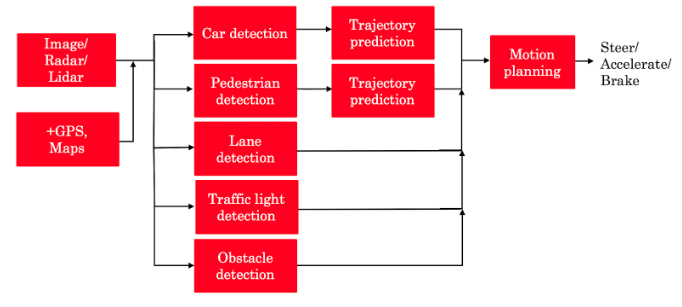
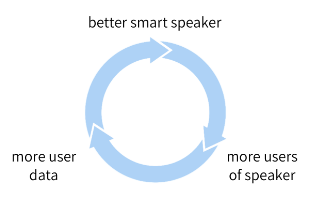
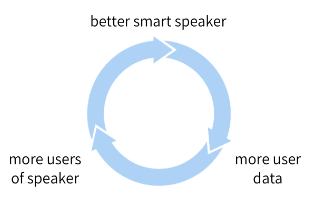
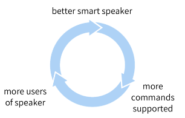
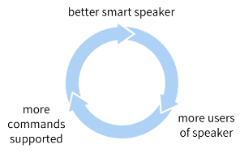

**1.** Because smart speakers can carry out multiple functions (such as tell a joke, play music, etc.) it is an example of Artificial General Intelligence (AGI).
- [ ] True
- [x] False

**2.** What are the key steps to a smart speaker function?
- [ ] Trigger detection -> intent recognition -> speech recognition -> command execution.
- [ ] Trigger word detection -> intent recognition -> speech recognition -> command execution.
- [x] Trigger word detection -> speech recognition -> intent recognition -> command execution.
- [ ] Speech recognition → Trigger word detection -> intent recognition -> command execution.

**3.** 

The component for pedestrian detection is usually built using:
- [ ] A motion planning algorithm
- [ ] GANs
- [ ] Reinforcement learning
- [x] Supervised learning

**4.** Suppose you are building a trigger word detection system, and want to hire someone to build a system to map from Inputs A (audio clip) to Outputs B (whether the trigger word was said), using existing AI technology. Out of the list below, which of the following hires would be most suitable for writing this software?
- [ ] Data engineer
- [ ] AI Product Manager
- [ ] Machine learning researcher
- [x] Machine learning engineer

**5.** What is the first step in the AI Transformation Playbook for helping your company become good at AI?
- [ ] Build an in-house AI team
- [ ] Provide broad AI training
- [ ] Develop an AI strategy
- [x] Execute pilot projects to gain momentum

**6.** Of the following options, which is the most important trait of your first pilot project?
- [x] Succeed and show traction within 6-12 months
- [ ] Drive extremely high value for the business
- [ ] Be executed by an in-house team
- [ ] None of the above

**7.** Say you are building a smart speaker, and want to accumulate data for your product through having many users. Which of these represents the “Virtuous circle of AI” for this product?
- [x] (A)

- [ ] (B)

- [ ] (C)

- [ ] (D)

**8.** Why is developing an AI strategy NOT the first step in the AI Transformation Playbook?
- [ ] There is no reason. Developing an AI strategy IS the first step in the AI Transformation Playbook.
- [ ] The strategy should be to use the Virtuous Circle of AI, which comes after building a product.
- [ ] When transforming a company into an AI company, one does not need a strategy, therefore it can’t be the first step.
- [x] Without having some practical AI experience and knowing what it feels like to build an AI project, a company usually does not know enough to formulate a sound strategy.

**9.** According to the AI Transformation Playbook, broad AI training needs to be provided not only to engineers, but also to executives/senior business leaders and to leaders of divisions working on AI projects.
- [x] True
- [ ] False

**10.** Which of the following are AI pitfalls to avoid? (Select all that apply)
- [ ] Pairing engineering talent with business talent to identify feasible and valuable projects.
- [x] Expecting AI to solve everything
- [x] Expecting AI based projects to work the first time
- [x] Expecting traditional planning processes to apply without changes
